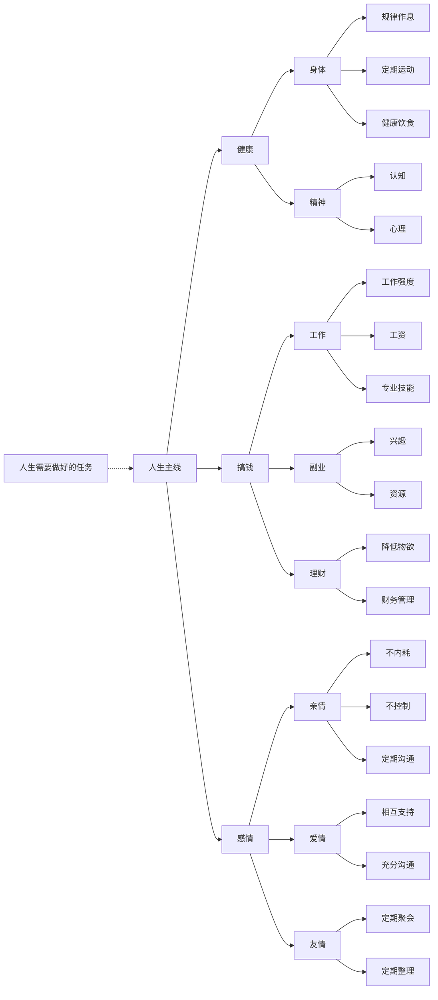

周六清晨，7:10的闹钟如常唤醒了沉睡的意识。手指刚触碰到衣角，才恍然记起今日无需赶赴工作的匆忙。日光渐长，我才拖着慵懒的步伐去了那家光顾无数次的小店，一碗朴实的海带豆腐面，平淡却暖胃。午后，携着爱人漫步湖滨银泰，指间试探着象征永恒的圆环，又沿着西湖岸边闲走，看松鼠在指尖轻啄食物的小心翼翼，品一杯余香袅袅的咖啡，时光在这细碎的幸福中缓缓流淌。明日与刀哥、罗佬的聚会，想来是与刀哥在杭州的最后一次把酒言欢，心头漾起些许不舍。

久未提笔，此刻窗外雨声初歇，花香随着微风悄然潜入室内，便一时兴起，指尖敲击键盘的节奏伴随着思绪的流动。借此机会梳理年来的所思所感，也作为明日畅谈的话题铺垫。这一刻，万籁俱寂，唯有风过窗棂的轻响与心头涌动的文字相伴，倒也恬静自在。

年初组织的重构让我步入全新的项目领域，开始探索对话系统这片未知的天地。而五月婚礼的筹备，又让生活填满了琐碎却美好的期待。在此起彼伏的忙碌中，我发现自己有意无意地减少了书写的频率，或许是因为生活的变化需要沉淀，亦或是思绪尚未整理成形，待到心湖平静，定当笔墨重现。

#### 我所热爱的生活

一直以为杭州最美的时候分别在冬春之交和秋冬之交。过去的三四月万紫千红，花红柳绿，实在让人留恋。开年在元宵节的时候去了西溪湿地赏了花灯，去浙江大学华家池校区沿湖散步，清明节的时候自驾去横店呆了两天。在过去的很多年，一直自以为是一个工作狂。虽然经常被老爸吐槽，要把家庭和生活放在第一位。可能随着年龄渐长，才能渐渐明白其中的滋味，这个世界好像与自己有关，也好像与自己无关，但是你的生活永远是你自己的。最近看到一个人生需要做好的主线任务如下:

其实这么看来，生活本身也没有那么的复杂，也许只是在不同的时期，不同要素的权重存在不同。正如此刻正是周日的早晨，窗外微风习习，鸟语花香，昨夜的潮湿氤氲在柔软温暖的风中，嘬一口手冲咖啡，迎来一天的好心情。

#### 工作的意义

进入到新的项目组，意味着不同的管理模式，由于是集团重点项目，存在多头head管理，同时似乎head们的hands on的能力不足，导致决策质量较低。因此，时常在项目推进中发现自以为比较滑稽的事情。幸运地是，自己能够独立负责一条线，具有较大的决策权，在整体的方向上和推进节奏上，能够基本满足自己的预期，这种工作模式比较符合自己的偏好。

但是似乎项目做好了，除了自身的项目经历又多了一个而已，对于自身的成长和思考提升有限，对于晋升和年终奖似乎也影响不大。

于是就有一个问题，工作的投入度到底怎样是合适的？经常被女票吐槽，工作容易上头，操着老板的心，不值当。在前几年，自己其实不以为然，因为所有的项目都是成长，随着经历的累加，项目对于自己的提升其实渐渐变的有限。此外，渐渐认识到一个人职业生涯的成功，存在各种偶然性，个人的努力只是非常有限的一部分。因此，这种认知的转变，势必让自己去思考，5年的工作经历之后，如何对待接下来的工作？

今年在招聘面试过程中，面试了非常多的候选人，由于基本要求是5年以上的经历，但是其实聊了一圈下来，发现大家在5年之后，整体的差异性在项目经历上似乎不是很明显，多数人的简历其实是项目的广度增加了，深度不足，同时思考也不足，乏善可陈。整体表现出来的特点是，如果你是优秀的，简历会非常优秀。如果你不是优秀的，简历会和很大一部分人的基本不存在同质化差异。其实看自己的简历内容，除了写了差不多10年的技术博客，有一些star还不错的开源项目经历，有一些独立操盘的小产品等，似乎也不存在较大的亮点。

**一个5年的算法和一个10年的算法到底有什么不同？一个算法的核心竞争力到底是什么？**

#### 创业的困境

大三到读研之前，自己通过技术入股参与到一个创业公司的建立，那种沉浸式的快乐至今让人印象深刻，所以有幸在较早的时候体验过老板思维。读研之后工作至今，这种思维一直伴随，但是今年似乎打工思维逐渐变得强烈。在不同的团队经历过各种不同的事情，比如团队业务负责人逐渐被边缘化，+1突然被撸秃，某个很努力的同事就是拿不到好的绩效等，戏谑的说，好像逐步认清了职场的真相，哈哈哈，我倒希望自己是错的。但是好的地方在于，自己只是开始去承认这种问题的存在，但是没有过度关注，在聚焦真正的价值上，从未动摇过。

去年做了搜医搜，就是要验证自己的独立全栈能力。今年逐步看到一些机会，比如财税方向，医疗方向，零售方向等，但是似乎又很难验证是不是真正的机会？有些时候会丧丧地说，好像做2B也不错。虽然从21年11月以来，大模型如火如荼，而自己似乎也刚刚好赶上了，但是思来想去，似乎也并不存在真正的机会。如果本着长期价值去，可能在没看到曙光之前大概率就死翘翘了。因此可以看到很多timing的生意，包括manus[等](https://www.163.com/dy/article/JT9Q9KN505567EZL.html)，这让自己慢慢去思考，投机是合理的？赚快钱的逻辑似乎在接触到的一些创业者身上能够感受到一些。MCP依然不是创业者的机会。

似乎很多机会最终都是大厂的机会，大厂可以用足够的资源把想收的价值都给收到。[朱啸虎在前不久的中关村的演讲](https://mp.weixin.qq.com/s/KrteaOl9W0yYuvE02H3PbA)被一些比较专的创业者喷的很凶，之前的[文章](https://baijiahao.baidu.com/s?id=1818136497037185489&wfr=spider&for=pc)中也表达过类似观点，但是回归到真实世界，似乎也不是没有道理。真实世界，都是血淋淋的。从来都是黑暗森林法则，大佬吃肉，其他人喝汤，如果大佬连汤也要喝，其他人只能饿死。

但是转念一想，OpenAI的ChatGPT,DeepSeek,Anthrophic的Claude Sonnet，也是我自己能够真正承认的硬核工作。

作为其他人中的一员，我不想被饿死，也不想被撸秃，但是我也有房贷要还，于是我该怎么办就成了一个问题。

#### 回归自身

从去年开始，自己就逐渐退出很多所谓的技术讨论群，取关很多公众号等，一年过去了，自己似乎并没有错过很多东西，重要的是，随着自己逐渐变的更老，一个好处是你会很容易判断这个事情是否是重演，只是演员不同了，导演变了而已，而你还是那个过客。故事还是那个故事，只是讲故事的人变了。听故事的人好像也变了，但是我没变啊。

自己的共情能力似乎也变得更强了，更容易形成一些非共识。因此，我认同杨值麟的[《向延绵而未知的雪山前进》](https://36kr.com/p/2677672437708552)中的大多数观点（_**这里可以单独写一篇文章讨论这个话题**_），我也为竹间智能[《我要活下去，才能看见梦》](https://baijiahao.baidu.com/s?id=1792287353781193640&wfr=spider&for=pc)而唏嘘，更为[《从DeepSeek R1到哪吒2:中国用户知道什么是好产品》](https://www.notion.so/zhpmatrix/DeepSeek-R1-2-19468ac27add80fa96cae5300454b924?pvs=4)而感到激动。

回到自己开博语中写的一句话，人只有永远保持清醒，才能看到真正的价值，所幸自己从来没有忘记。

世界从来都是自己的，与他人无关，我需要更多落子无悔的智慧。

