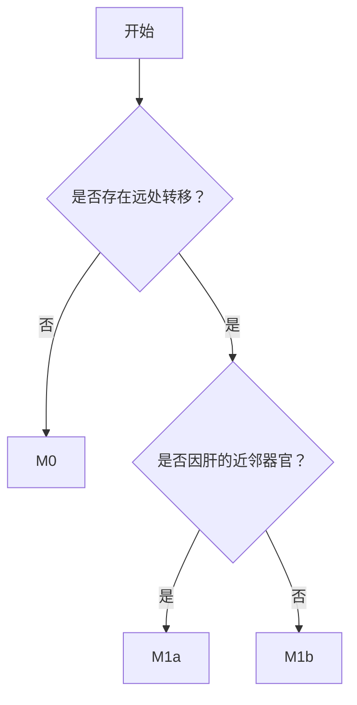

对于一个能够实现推理的系统，笔者比较关注的包含基于显式符号逻辑的和基于隐式连接逻辑的方向。其中前者依赖数据结构的构建，可能的结构包括一维的规则，数和图（贝叶斯网络）等，隐式连接逻辑基本的一个思路是：通过将显式的符号逻辑按照推理路径转化为训练数据，通过模型训练，将数据中的推理逻辑进行压缩，同时希望能够带来推理能力的泛化（如果没有泛化，可能几乎就没有价值）。这篇文章讨论的是前者中的数据结构设计。

#### 法律中的树应用

##### 合同审查

典型场景是[合同审查](https://mp.weixin.qq.com/s/AElkNKm7qRHsXm803VDO3Q)。审查点通常是一个封闭性问题，比如“如果...那么...”的逻辑表达。通过将复杂的审查逻辑拆解为可视化的树状推理结构，利用一个知识推理机，通过对审查对象进行结构化，即可沿树进行推理，使得审核结果可解释，可追溯，显著提升审查结果的准确性和稳定性。

##### 法规结构化推理

在[文章](https://towardsdatascience.com/legal-rules-structure-the-reasoning-in-legal-documents-fbd59c67a17b/)中讨论法规的规则化，可以通过**and/or+if/else**的方式来描述规则（对应与或树的结构），但是这里同时增加了strong和weak的区分，如下：

#### 医疗中的树应用

##### 合理用药
医疗场景下的主要应用是[合理用药](https://mp.weixin.qq.com/s/dx8z8jahBWD9zT6Z0myDwA?version=4.1.31.99548&platform=mac)。通过提供开放易用并具有扩展性的规则自维护平台，可以将来自药品说明书和文献的知识规则化。这里的规则可以类比法律中的审查点。

##### TNM分期推理
笔者自己做的一个场景是癌症TNM分期的推理。主要流程如下：

（1）医学知识团队生产多个具体流程图。如下（不完全，仅示例）：

（2）算法团队开发与具体流程图无关的推理算法（基于树的搜索算法）。

（3）根据流程图的节点，算法团队开发实体/标签识别算法，如“是否有远处转移？”、“是否因肝的近邻器官”等。

（4）推理流程：输入病理报告文本，算法抽取报告中的标签值，遍历流程图到叶子节点，得到分期结果。其中从根节点到叶子节点形成一个推理路径。

其中的流程图是通过树结构来实现的。

##### 鉴别诊断临床指导树（[呼吸困难症作为主诉](https://arxiv.org/pdf/2312.02441)）

首先需要构建临床指导树，如下：

围绕树的构建有一些不错的工作，比如《Construction of Guideline-Based Decision Tree for Medication Recommendation 》中的通过利用知识驱动和数据驱动的方式构建一棵网状决策树，如下:

其他工作如EMNLP2024的文章《Generative Models for Automatic Medical Decision Rule Extraction from Text》等。

基于临床指导树，可以构建一个推理引擎如下：

其中的IEET(If-Elif-Else Tree)也可以直接作为大模型的推理参考，如下：

通过CGT可以不断地在交互中获取用户信息，最终通过**检索的方式**（具体可以参照文章最后章节内容）实现患者信息和决策知识的匹配。

由于推理过程中需要利用历史对话信息，因此对记忆的应用就是一个潜在扩展点，可以参考近期的这个工作，《Mem0- Building Production-Ready AI Agents with Scalable Long-Term Memory》，通过分别提供基于语义(embedding)和基于实体(graph)的方式来实现对话记忆的管理。

##### 检查预约

在SalesForce Research的工作中，[《Converse-A Tree-Based Modular Task-Oriented Dialogue System》](https://www.salesforce.com/blog/converse-task-oriented-dialogue-system/)，通过构建一棵与或树，对话过程中通过该树进行引导医生和患者的对话，具体如下：

相比上边的各种树，与或树的关键是节点的属性存在and和or的关系，类似上文中提到的法规结构化推理中发现的逻辑关系。从这个角度可以看到，在知识处理方式上，医疗和法律存在较大的相关性。

#### 医疗中的图应用

在《MindMap: Knowledge Graph Prompting Sparks Graph of Thoughts in Large Language Models》中，对于图的利用是在一个RAG框架中，知识图谱会作为检索源之一，通过在生成阶段补充来自图的相关知识，增强模型的推理能力。比如模型的输出如下：

GraphRAG也是针对该思路的一个具体表达。

#### 财税中的图应用

对于某个二维表表示的财税规则，如规则A：如果数电发票=是，发票税率=9%，那么能否抵扣=可以抵扣，能抵多少=抵1%，如何填报=XXXX。类似的有规则B，规则C等，基于上述规则可以直接转化为如下图谱：

当需要知道与“能否抵扣=可以抵扣”相关的规则时，可以基于二维表通过直接搜索的方式得到相关的规则，但是基于图谱可以采用图遍历的方式得到相同的结论，意味着图谱首先具有二维表的表达能力，其次理论上图谱通过建立节点和关系，能够实现更加丰富的上下文表达。

**加约束条件下的各种结构之间的等价性推演以及更复杂结构的优势识别是待思考的问题。**

综合上述场景，一个围绕树构建的推理系统的核心组件包括如下：

（1）含有业务推理规则的树(树的节点的属性可自定义，如and/or等)。该部分内容的生产主要来自业务专家团队，包括财税专家，医学专家，金融专家，法律专家等

（2）一个能够支持树编辑的规则生产系统，含管理等

（3）一个基于树结构的推理系统，本质上是基于树的遍历算法，但是这个算法的实现可以是naive的树搜索，也可以是基于llm的，或者基于embedding相似度匹配等，但是该算法和具体的树结构无关，如深度和高度等

（4）一个映射逻辑。通过将输入进行结构化，基于结构化的结果建立和树的映射关系。naive的映射逻辑中，结构化是必然的，但是没有结构化，理论上也是可以实现映射，具体实现方式待探讨

当这个结构为图时，上述组件设计依然存在。树是图的一种特例。

基于这样的推理系统，在实现可追溯，可解释的同时，也丧失了系统在推理上的弹性，但是基于树结构的知识管理是弹性的，通过策略设计也可以增加系统的弹性。

任何的架构设计，一旦被设计出来，意味着同时具有天然的缺点，关键是实现架构和场景的匹配。所谓“匹配”意味着单独讨论架构，或者单独讨论场景，都没有将二者匹配起来讨论更有意义。

#### 相关材料

+ 《Task-Oriented Dialogue with In-Context Learning》，RASA的文章，结构上是一个平铺的if...then...的逻辑，在实现中更加接近于function call的逻辑
+ [《融合知识图谱与大模型的中医临床辅助决策系统》](https://mp.weixin.qq.com/s/4HOpCHLVVQSNhVkoNdgwUw)

**[扫码加笔者好友](https://zhpmatrix.github.io/about/)，茶已备好，等你来聊~**