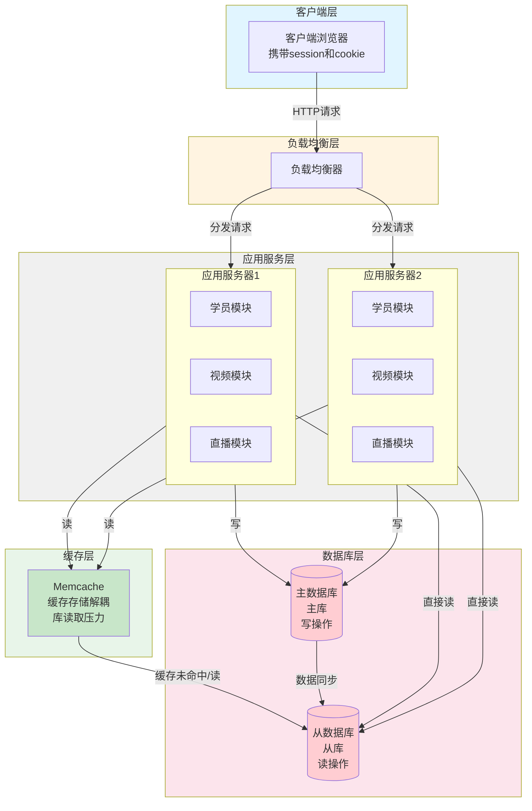

# Web应用开发架构图

## Mermaid流程图代码

## 架构说明

### 1. 客户端层
- 用户通过浏览器访问，携带session和cookie信息
- 发起HTTP/HTTPS请求到负载均衡器

### 2. 负载均衡层
- 接收客户端请求
- 根据负载均衡策略（轮询、最少连接等）将请求分发到不同的应用服务器
- 实现高可用和流量分发

### 3. 应用服务层
- 多个应用服务器实例（水平扩展）
- 每个服务器包含相同的业务模块：
  - 学员模块：用户管理、认证等
  - 视频模块：视频播放、点播等
  - 直播模块：实时直播服务
- 实现无状态设计，便于扩展

### 4. 缓存层（Memcache）
- 缓存热点数据，减少数据库访问压力
- 实现存储解耦，提高读取性能
- 降低数据库读取压力，提升系统响应速度

### 5. 数据库层
- **主数据库（Master）**：处理所有写操作
- **从数据库（Slave）**：处理读操作
- 主从同步：主库数据自动同步到从库
- 读写分离：提高数据库性能和可用性

## 数据流向

### 读操作流程
1. 客户端请求 → 负载均衡器 → 应用服务器
2. 应用服务器先查询Memcache缓存
3. 缓存命中：直接返回数据
4. 缓存未命中：从从库读取数据，并更新缓存

### 写操作流程
1. 客户端请求 → 负载均衡器 → 应用服务器
2. 应用服务器写入主数据库
3. 主数据库同步数据到从数据库
4. 根据策略更新或失效缓存

## 关键技术点

- **缓存存储解耦**：通过Memcache实现应用与数据库的解耦
- **库读取压力**：通过缓存和读写分离降低数据库压力
- **水平扩展**：应用服务器可以根据负载动态扩容
- **高可用性**：多实例部署，单点故障不影响整体服务
- **读写分离**：优化数据库性能，主库负责写，从库负责读

